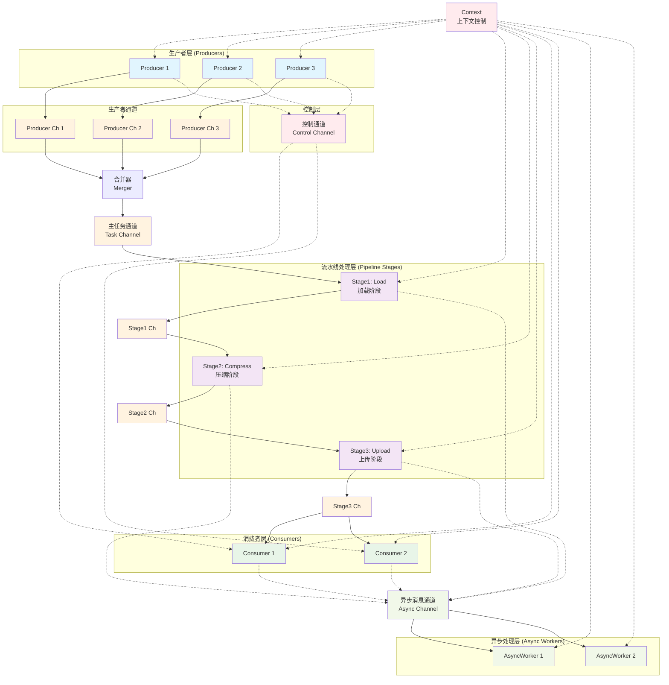

# Go 并发流水线系统

一个高性能的 Go 并发流水线系统，展示了多生产者-多消费者模式、异步任务处理和优雅关闭机制的最佳实践。

## 🚀 特性

- ✅ **多阶段流水线**：支持任意数量的处理阶段
- ✅ **多生产者多消费者**：高并发数据生产和消费
- ✅ **异步任务处理**：非阻塞的状态报告和日志记录
- ✅ **优雅关闭**：基于 Context 的生命周期管理
- ✅ **错误处理**：完善的超时和取消机制
- ✅ **无死锁设计**：精心设计的 channel 关闭策略

## 📊 系统架构



## 🔄 数据流说明

### 主要数据流（实线）
1. **生产者** 生成任务 → **独立生产者通道**
2. **合并器** 收集所有生产者输出 → **主任务通道**
3. **流水线阶段** 依次处理：加载 → 压缩 → 上传
4. **消费者** 接收最终处理结果

### 控制信号流（虚线）
- 生产者完成时发送控制信号
- 消费者接收控制信号进行状态管理

### 异步消息流（虚线）
- 各组件发送状态更新到异步通道
- 异步工作器负责日志记录和监控

## 🏗️ 核心组件

### 数据结构

```go
type Task struct {
    ID    int    // 任务唯一标识
    Name  string // 任务名称
    Stage int    // 当前处理阶段
}

type Control struct {
    Cmd string   // 控制命令
}
```

### 关键组件

| 组件 | 数量 | 职责 |
|------|------|------|
| Producer | 3 | 生成任务数据 |
| Stage | 3 | 流水线处理（加载、压缩、上传） |
| Consumer | 2 | 消费最终结果 |
| AsyncWorker | 2 | 异步消息处理 |
| Merger | 1 | 合并多生产者输出 |

## 🚀 快速开始

### 环境要求

- Go 1.18+
- 支持 goroutine 和 channel 的环境

### 运行示例

```bash
# 克隆代码
git clone <repository-url>
cd concurrent-pipeline

# 运行示例
go run main.go
```

### 预期输出

```
[Producer 1] Send {ID:10 Name:Task-1-0 Stage:0}
[Producer 2] Send {ID:20 Name:Task-2-0 Stage:0}
[Stage1-Load] Processing {ID:10 Name:Task-1-0 Stage:0}
[AsyncWorker 1] Stage1-Load completed stage 1 for task 10
[Stage2-Compress] Processing {ID:10 Name:Task-1-0 Stage:1}
[AsyncWorker 2] Stage2-Compress completed stage 2 for task 10
[Stage3-Upload] Processing {ID:10 Name:Task-1-0 Stage:2}
[Consumer 1] Received {ID:10 Name:Task-1-0 Stage:3}
[AsyncWorker 1] [Consumer 1] processed task 10
...
All tasks completed successfully!
```

## ⚙️ 配置参数

### Channel 缓冲区大小

```go
taskCh := make(chan Task, 10)      // 主任务通道
ctrlCh := make(chan Control, 5)    // 控制信号通道
asyncCh := make(chan string, 50)   // 异步消息通道
```

### 超时设置

```go
ctx, cancel := context.WithTimeout(context.Background(), 30*time.Second)
```

### 处理延迟

```go
time.Sleep(150 * time.Millisecond) // 流水线阶段处理时间
time.Sleep(50 * time.Millisecond)  // 异步工作器处理时间
```

## 🔧 自定义扩展

### 添加新的流水线阶段

```go
// 创建新阶段通道
stage4Ch := make(chan Task, 10)

// 添加新处理阶段
wg.Add(1)
go func() {
    defer wg.Done()
    stage(ctx, "Stage4-Validate", stage3Ch, stage4Ch, asyncCh)
}()
```

### 增加生产者数量

```go
// 扩展生产者数组
producerCount := 5
producerChannels := make([]chan Task, producerCount)

for i := 0; i < producerCount; i++ {
    producerChannels[i] = make(chan Task, 5)
    wg.Add(1)
    go func(id int, ch chan Task) {
        defer wg.Done()
        producer(ctx, id+1, ch, ctrlCh)
    }(i, producerChannels[i])
}
```

### 自定义任务类型

```go
type CustomTask struct {
    Task                    // 嵌入基础任务
    Priority    int        // 优先级
    Metadata    map[string]interface{} // 自定义元数据
    ProcessTime time.Duration // 预计处理时间
}
```

## 🛡️ 错误处理

### Context 取消处理

所有 goroutine 都响应 context 取消信号：

```go
select {
case <-ctx.Done():
    fmt.Printf("Component cancelled: %v\n", ctx.Err())
    return
default:
    // 继续正常处理
}
```

### Channel 关闭检测

```go
case task, ok := <-taskCh:
    if !ok {
        fmt.Println("Channel closed, exiting...")
        return
    }
    // 处理任务
```

### 超时保护

```go
select {
case result := <-processChannel:
    // 处理结果
case <-time.After(5 * time.Second):
    // 超时处理
case <-ctx.Done():
    // 取消处理
}
```

## 📈 性能特点

### 吞吐量优化

- **并发处理**：多个生产者和消费者并行工作
- **流水线并行**：任务在不同阶段同时处理
- **缓冲通道**：减少 goroutine 阻塞时间

### 内存使用

- **有界缓冲区**：防止内存无限增长
- **及时关闭**：避免 goroutine 泄露
- **资源复用**：高效的 channel 使用

### 扩展性

- **水平扩展**：可轻松增加处理节点
- **垂直扩展**：支持增加处理阶段
- **负载均衡**：消费者自动负载分担

## 🔍 监控和调试

### 日志级别

- **INFO**：正常任务处理流程
- **DEBUG**：详细的 channel 操作
- **ERROR**：错误和异常情况

### 性能指标

```go
// 可添加的监控指标
type Metrics struct {
    TasksProduced    int64
    TasksProcessed   int64
    AverageLatency   time.Duration
    ActiveGoroutines int
}
```

### 调试技巧

1. **增加日志输出**：在关键点添加详细日志
2. **Channel 状态监控**：监控 channel 的缓冲区使用情况
3. **Goroutine 泄露检测**：使用 `runtime.NumGoroutine()` 监控
4. **死锁检测**：合理设置超时时间

## 🤝 最佳实践

### Do's ✅

- 使用 Context 进行生命周期管理
- 合理设置 Channel 缓冲区大小
- 实现优雅关闭机制
- 添加超时保护
- 使用非阻塞 Channel 操作

### Don'ts ❌

- 不要在多个 goroutine 中关闭同一个 Channel
- 不要忽略 Context 取消信号
- 不要使用无缓冲 Channel 进行高并发通信
- 不要忘记处理 Channel 关闭情况
- 不要在生产环境中使用无限循环

## 📚 相关资料

- [Go 并发模式](https://go.dev/blog/pipelines)
- [Context 包使用指南](https://go.dev/blog/context)
- [Channel 最佳实践](https://go.dev/doc/effective_go#channels)
- [Goroutine 泄露预防](https://go.dev/blog/pipelines)

## 🐛 故障排除

### 常见问题

| 问题 | 原因 | 解决方案 |
|------|------|----------|
| 程序挂起 | Channel 死锁 | 检查 Channel 关闭逻辑 |
| 内存泄露 | Goroutine 未退出 | 添加 Context 取消处理 |
| 数据丢失 | Channel 关闭时机不当 | 确保数据处理完成后再关闭 |
| 性能低下 | Channel 缓冲区太小 | 适当增加缓冲区大小 |

### 调试命令

```bash
# 检查 goroutine 数量
go tool pprof http://localhost:6060/debug/pprof/goroutine

# 内存使用分析
go tool pprof http://localhost:6060/debug/pprof/heap

# CPU 性能分析
go tool pprof http://localhost:6060/debug/pprof/profile
```

## 📄 许可证

MIT License - 详见 [LICENSE](LICENSE) 文件

## 🙋‍♂️ 贡献

欢迎提交 Issue 和 Pull Request！

1. Fork 本项目
2. 创建特性分支 (`git checkout -b feature/AmazingFeature`)
3. 提交更改 (`git commit -m 'Add some AmazingFeature'`)
4. 推送到分支 (`git push origin feature/AmazingFeature`)
5. 开启 Pull Request

---

**⭐ 如果这个项目对你有帮助，请给一个 Star！**
