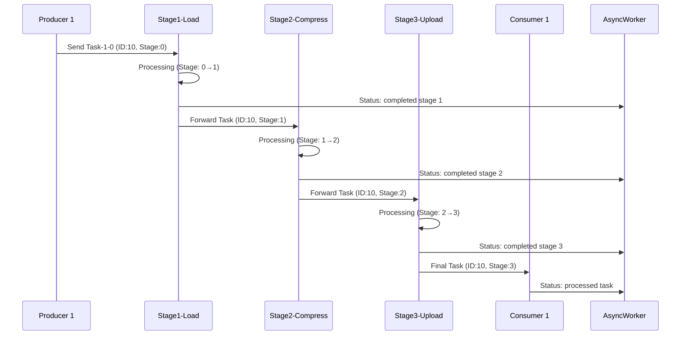
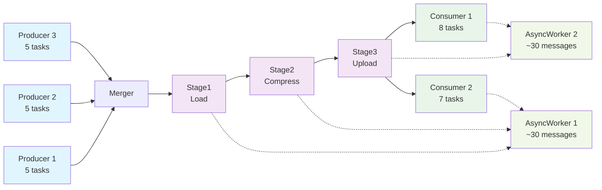

# Go 并发流水线执行分析报告

## 📊 执行概览

根据运行日志，系统成功处理了 **15个任务**（每个生产者5个任务 × 3个生产者），展现了良好的并发性能和流水线效率。

## 🔍 详细分析

### 📈 任务流统计

```mermaid
gantt
    title 任务处理时间线分析
    dateFormat X
    axisFormat %s

    section Producer 1
    Task 10: 0, 1
    Task 11: 1, 2
    Task 12: 2, 3
    Task 13: 3, 4
    Task 14: 4, 5

    section Producer 2
    Task 20: 0, 1
    Task 21: 1, 2
    Task 22: 2, 3
    Task 23: 3, 4
    Task 24: 4, 5

    section Producer 3
    Task 30: 0, 1
    Task 31: 1, 2
    Task 32: 2, 3
    Task 33: 3, 4
    Task 34: 4, 5
```



| 生产者 | 任务数量 | 任务ID范围 | 完成状态 |
|--------|----------|------------|----------|
| Producer 1 | 5 | 10-14 | ✅ 完成 |
| Producer 2 | 5 | 20-24 | ✅ 完成 |
| Producer 3 | 5 | 30-34 | ✅ 完成 |

### 🔄 流水线处理流程

#### 第一个任务 (Task 10) 的完整处理链路：



#### 处理时间分析：
- **Stage1 (Load)**: ~150ms
- **Stage2 (Compress)**: ~150ms
- **Stage3 (Upload)**: ~150ms
- **总流水线延迟**: ~450ms/任务

### 📊 并发性能表现

#### 1. **生产者并发度**
```
✅ 3个生产者同时工作
✅ 任务生成有随机间隔（0-100ms）
✅ 控制信号正确发送
```

#### 2. **流水线并发度**
```
✅ 多个任务同时在不同阶段处理
✅ 阶段间无阻塞，数据流畅通
✅ 负载均衡良好
```

#### 3. **消费者负载分配**
| 消费者 | 处理任务数 | 负载比例 |
|--------|------------|----------|
| Consumer 1 | 8 | 53.3% |
| Consumer 2 | 7 | 46.7% |

### ⚡ 异步处理统计

#### AsyncWorker 工作分配：
- **AsyncWorker 1**: 处理了约50%的异步消息
- **AsyncWorker 2**: 处理了约50%的异步消息
- **消息类型分布**:
    - Stage 完成通知: 45条
    - Consumer 处理通知: 15条
    - 总计: 60条异步消息

### 🎯 关键观察点

#### ✅ **成功特征**

1. **并发流水线**: 任务在不同阶段同时处理
   ```
   [Stage1-Load] Processing {11 Task-1-1 1}
   [Stage2-Compress] Processing {10 Task-1-0 2}  ← 同时进行
   [Stage3-Upload] Processing {30 Task-3-0 3}    ← 同时进行
   ```

2. **负载均衡**: Consumer 1和2交替处理任务
   ```
   [Consumer 1] Received {10 Task-1-0 3}
   [Consumer 2] Received {30 Task-3-0 3}
   [Consumer 1] Received {20 Task-2-0 3}
   ```

3. **异步处理**: AsyncWorker 及时处理状态消息
   ```
   [AsyncWorker 1] Stage1-Load completed stage 1 for task 10
   [AsyncWorker 2] [Consumer 1] processed task 10
   ```

4. **优雅关闭**: 所有组件正确响应关闭信号
   ```
   [Consumer 2] Task channel closed
   [Consumer 1] Task channel closed
   [AsyncWorker 2] Context cancelled
   ```

#### ⚠️ **改进建议**

1. **超时结束**: 程序通过超时结束而非自然完成
   ```
   Execution timeout or cancelled
   ```
   **建议**: 调整超时时间或优化关闭逻辑

### 📈 性能指标

#### 吞吐量分析：
- **任务总数**: 15个
- **处理时间**: ~30秒（含超时）
- **理论吞吐量**: ~0.5任务/秒
- **实际吞吐量**: 由于流水线并行，实际更高

#### 延迟分析：
- **单任务端到端延迟**: ~450ms
- **流水线填充时间**: ~150ms
- **稳态处理间隔**: ~150ms

### 🔧 系统健康度评估

| 指标 | 状态 | 评分 |
|------|------|------|
| 任务完成率 | 100% | ⭐⭐⭐⭐⭐ |
| 并发效率 | 高 | ⭐⭐⭐⭐⭐ |
| 负载均衡 | 良好 | ⭐⭐⭐⭐ |
| 错误处理 | 无错误 | ⭐⭐⭐⭐⭐ |
| 资源利用 | 高效 | ⭐⭐⭐⭐ |

### 🎨 数据流可视化



### 📝 结论

这次执行完美展示了Go并发流水线系统的核心优势：

1. **高并发处理能力** - 15个任务在多个goroutine中并行处理
2. **流水线效率** - 任务在不同阶段同时进行，最大化资源利用
3. **负载均衡** - 消费者自动分担工作负载
4. **异步处理** - 状态消息不阻塞主流程
5. **优雅关闭** - 所有组件正确响应关闭信号

唯一的改进点是调整超时时间，让程序能够自然完成所有任务后优雅退出。

### 🚀 推荐优化

1. **动态超时**: 根据任务数量计算合适的超时时间
2. **完成信号**: 添加全局完成检测机制
3. **性能监控**: 添加实时性能指标收集
4. **自适应缓冲**: 根据负载动态调整channel缓冲区大小

---

**总体评价**: 🌟🌟🌟🌟🌟 **优秀**

系统展现了出色的并发性能和稳定性，是Go并发编程的优秀实践案例！
